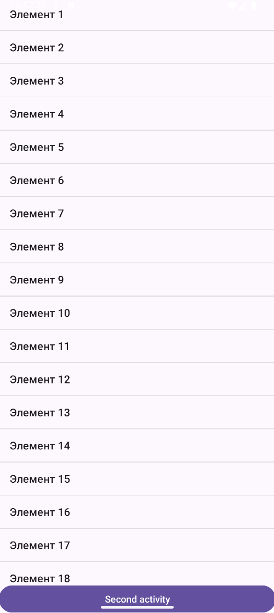
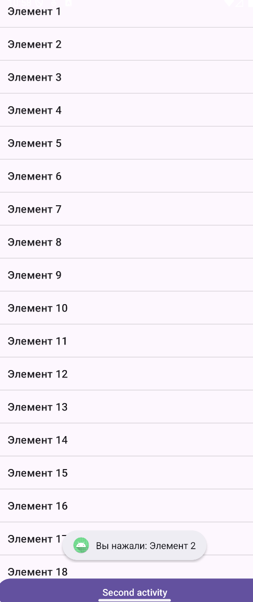
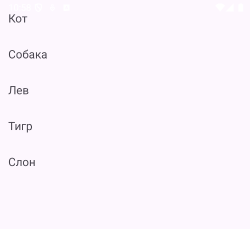

1. Сделай простое приложение, где:
 
 - На экране есть ListView;
 - В список загружаются строки "Элемент 1", "Элемент 2", … "Элемент 20";
 - При клике на элемент показывается Toast с текстом "Вы нажали: Элемент X". 
 
2. Сделай приложение, где:
 
- На экране есть RecyclerView. 
- Список заполняется именами животных: ["Кот", "Собака", "Лев", "Тигр", "Слон"](создай отдельный класс Animal для хранения данных) 
- Каждый элемент отображается в кастомном item_layout.xml

